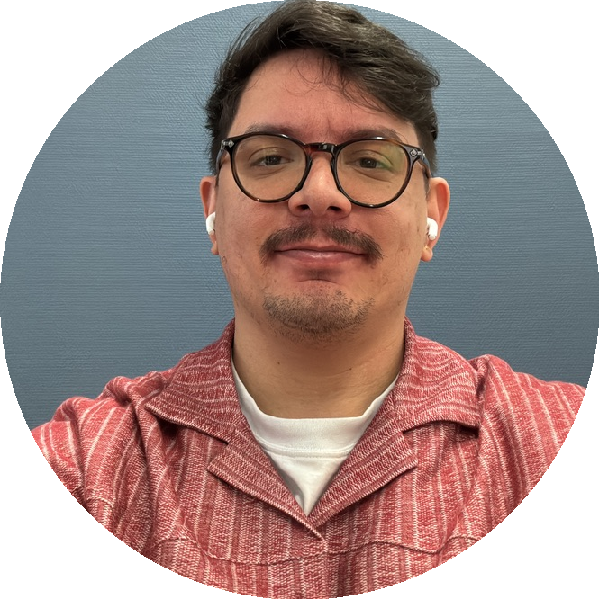

<p align="center">
  
</p>

<h1 align="center">Pierpaolo Vendittelli</h1>

<p align="center">
  <em>Postdoctoral Researcher · AI for Digital Pathology · ML Engineer</em>
</p>

<p align="center">
  <a href="resume-applied.pdf"></a>
  &nbsp;
  <a href="resume-research.pdf"></a>
  &nbsp;
  <a href="cv.pdf"></a>
</p>

<p align="center">
  <a href="mailto:pierpaolo.vendittelli93@gmail.com"></a>
  &nbsp;
  <a href="https://www.linkedin.com/in/pierpaolo-vendittelli"></a>
  &nbsp;
  <a href="https://github.com/PierpaoloV"></a>
</p>

---

## About

I am a Postdoctoral Researcher at the **Prinses Maxima Centre for Pediatric Oncology** (Utrecht, NL), working on deep-learning methods for digital histopathology applied to Wilms tumor. I hold a PhD from **Radboud University Medical Center** (expected June 2026), where I developed AI algorithms for pancreatic cancer pathology as part of the EU Horizon 2020 **PANCAIM** consortium.

My work sits at the intersection of **computer vision**, **medical image analysis**, and **software engineering** — from designing whole-slide image pipelines and multiple-instance learning models, to building LLM-powered automation tools.

I am currently open to **R&D**, **Applied Scientist**, and **ML Engineer** roles — preferably in Italy, remote EU, or US-remote.

---

## Documents

| Document | Audience | Format |
|---|---|---|
| [`resume-applied.pdf`](resume-applied.pdf) | Industry / ML Engineer roles | 1 page, engineering-focused |
| [`resume-research.pdf`](resume-research.pdf) | Research / R&D / Applied Scientist roles | 2 pages, publications-first |
| [`cv.pdf`](cv.pdf) | Academic / full record | 2 pages, includes honors and presentations |

---

## Build

Requires a full TeX Live distribution with XeLaTeX.

```bash
make all        # build all three documents
make applied    # resume-applied.pdf only
make research   # resume-research.pdf only
make cv         # cv.pdf only
```

---

## Stack

Built with [Awesome-CV](https://github.com/posquit0/Awesome-CV) — a clean LaTeX template using XeLaTeX, Roboto, and FontAwesome. Color theme: teal-green for the industry resume, dark-red for the research variants.
